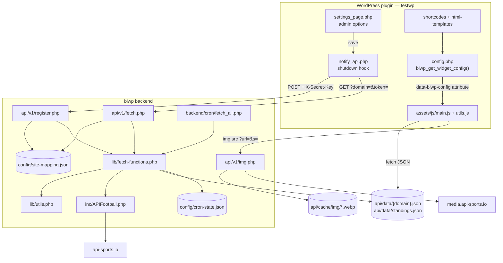
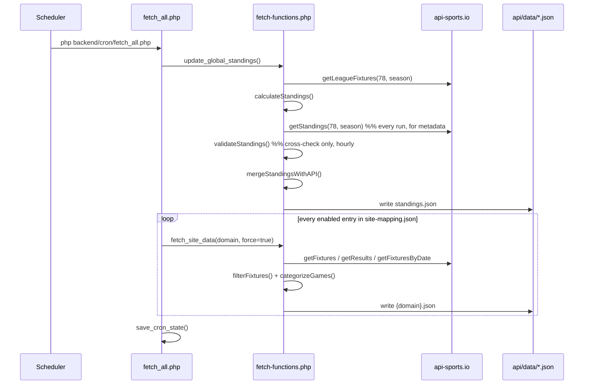
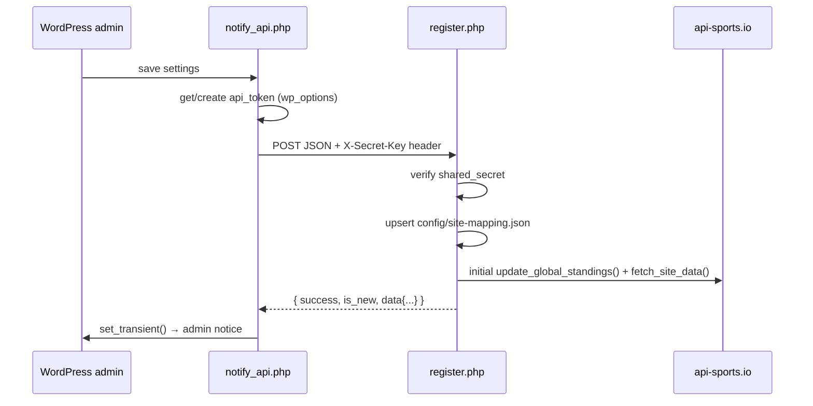

# Architecture

How the Buli Widgets system is put together, and why it is built this way.

- [System overview](#system-overview)
- [Why two applications](#why-two-applications)
- [Environment detection](#environment-detection)
- [Request flows](#request-flows)
- [Data flow in detail](#data-flow-in-detail)
- [Design decisions](#design-decisions)
- [Module map](#module-map)
- [Logging](#logging)
- [Known issues & debt](#known-issues--debt)

---

## System overview



Two independent codebases, joined by three HTTP contracts:

1. **Registration** — plugin `POST`s its config to `register.php` using a shared secret.
2. **Published data** — plugin JS `GET`s static JSON files. No auth, CORS `*`.
3. **Images** — plugin JS points `` at `img.php`, never at the raw CDN.

---

## Why two applications

The plugin could have called api-sports.io directly from each WordPress site. It doesn't,
because:

- **The API key would have to be distributed** to every customer site.
- **Quote/quota would be multiplied** by the number of sites, and each site would
  re-fetch the same shared data (the Bundesliga table is identical for everyone).
- **The upstream payloads are huge.** A single team's season fixtures is hundreds of KB;
  the widgets need a few dozen trimmed fields. Normalising server-side keeps the pages
  fast and means the paid quota is spent once, centrally.
- **Slow upstream responses never block a page render.** Publishing to static files means
  WordPress only ever reads a local JSON file (or fetches a cheap static one).

The cost is operational complexity: two apps, two deploy targets, and a contract that can
drift. That trade-off is the reason this document exists.

---

## Environment detection

Everything hinges on `backend/bootstrap.php`, which picks a _layout_ by probing for one
particular file:

```php
if (file_exists('/home/deploy/blwp/config/api-config.php')) {
    // production: flat layout outside the web root
} else {
    // development: nested blwp/backend/ layout
}
```

| Constant          | Development              | Production                              |
| ----------------- | ------------------------ | --------------------------------------- |
| `BLWP_CONFIG_DIR` | `<repo>/backend/config`  | `/home/deploy/blwp/config`              |
| `BLWP_LIB_DIR`    | `<repo>/backend/lib`     | `/home/deploy/blwp/lib`                 |
| `BLWP_INC_DIR`    | `<repo>/backend/inc`     | `/home/deploy/blwp/inc`                 |
| `BLWP_LOGS_DIR`   | `<repo>/backend/logs`    | `/home/deploy/blwp/logs`                |
| `BLWP_DATA_PATH`  | `<repo>/api/data`        | `/var/www/api.fcbinside.de/htdocs/data` |
| `BLWP_ENV`        | `development`            | `production`                            |
| API base URL      | `https://blwp.test/api/` | `https://api.fcbinside.de/`             |
| Web root          | the `blwp/` folder       | `/var/www/api.fcbinside.de/htdocs/`     |

Two consequences worth internalising:

- **In production the repo is split across two machines paths.** The `api/` subtree lands
  in the document root; the `backend/` subtree is flattened into `/home/deploy/blwp/`.
  There is no `backend/` directory in production.
- **`BLWP_DATA_PATH` and `$config['data_path']` are separate values** and differ by a
  trailing slash (`api-config.php` adds one). `img.php` uses the constant; `fetch-functions.php`
  uses the config array. Both point at the same directory.

> Anything that builds a path from `__DIR__` instead of these constants is a latent
> production bug. `v1/fetch.php` does exactly that for its early-debug log — see
> [Known issues](#known-issues--debt).

---

## Request flows

### 1. Scheduled refresh (the main path)



### 2. Registration / settings save

Triggered when an admin saves the plugin settings. The plugin hooks WordPress' `shutdown`
action so all options are already persisted.



### 3. Manual refresh

The plugin's "Refresh Data Now" button issues an authenticated GET. Rate limited to
`intervals.http_rate_limit` minutes (default 5) per domain, tracked in
`cron_state.sites.{domain}.last_manual_fetch`.

### 4. Page render (the hot path)

1. WordPress renders the shortcode → HTML shell + `data-blwp-config` JSON attribute.
2. `main.js` fetches `{apiUrl}data/{site}.json` and `{apiUrl}data/standings.json`.
3. It builds DOM nodes; every `` points at `{imgProxyUrl}?url=…&s=…`.

Steps 2–3 never touch PHP on this service — the JSON and cached images are served
statically by the web server.

---

## Data flow in detail

### Input normalisation

`filterFixtures()` in `utils.php` converts raw api-sports.io fixtures into the trimmed
shape the frontend uses, and applies the two transformations that make the payload
"display-ready":

```php
'league' => [ ..., 'round' => translateRound($item['league']['round'], $item['league']['id']) ],
'teams'  => [ 'home' => correctTeamName([...]), 'away' => correctTeamName([...]) ]
```

So the **frontend never translates rounds or fixes team names** — that happens once,
server-side, for every consumer.

### The status vocabulary

There is exactly **one** definition of which status codes mean what, in `utils.php`:

| Helper                   | Codes                                                        |
| ------------------------ | ------------------------------------------------------------ |
| `getFinishedStatuses()`  | `FT, AET, PEN, AWD, WO`                                      |
| `getInPlayStatuses()`    | `1H, HT, 2H, ET, P, BT, LIVE, INT, SUSP`                     |
| `getCountableStatuses()` | the union of the two — anything that may affect the table    |
| `classifyPhase()`        | maps a code to `finished` \| `live` \| `upcoming` \| `other` |

`filterFixtures()` stamps `status.phase` on every published game, and both
`categorizeGames()` and `calculateStandings()` read these helpers instead of carrying their
own copies.

This replaced **five** independent copies of the same lists — three in the backend (two in
`categorizeGames()`, one in `calculateStandings()`, plus a fourth used only to log live
games), and one in the frontend. The frontend now knows **no status codes at all**: it
branches on `status.phase` and keeps only the German _wording_ in `matchStatusMap`.

> An earlier revision of this document claimed `calculateStandings()` deliberately excluded
> `LIVE`, `INT` and `SUSP`. That was wrong — it always included them. The full per-code
> behaviour table is in [reference.md](reference.md#fixture-status-codes).

### Game classification (`categorizeGames`)

Fixtures and results are merged into three buckets. **Each bucket has its own dedupe guard**,
because a game can legitimately belong to two buckets at once. The bucket is decided from
`status.phase`, so the backend no longer inspects raw status codes here:

| Condition                                                       | Bucket(s)                         |
| --------------------------------------------------------------- | --------------------------------- |
| Today **and** status ∈ `1H, HT, 2H, ET, P, BT, LIVE, INT, SUSP` | `live`                            |
| Today **and** status ∈ `FT, AET, PEN, AWD, WO`                  | `live` **and** `results`          |
| Anything else (future games, today's games not yet kicked off)  | `fixtures` (with `isToday: true`) |

The **half-life** rule is why a game finished today lands in two places. It stays in `live`
until midnight so it does not vanish from the Spielplan tab the moment the final whistle
blows — the frontend detects that case (`isLive && isFinished`) and renders it with the
results layout. It is _also_ published to `results` immediately, so the Ergebnisse tab and
the form widget can show it without waiting for midnight.

The second half is a fix rather than a flourish. The buckets used to share a single
`$seen_ids` set, and because fixtures are processed first, every match finished today was
marked seen and then **skipped** by the results loop. The most recent result was therefore
missing from the Ergebnisse tab and, more visibly, from the form widget's "letzte N Spiele"
— the very match a reader had just watched.

`results` stays ordered newest-first: today's finished games are published by the fixtures
loop, which runs before the loop that appends older results, and the frontend relies on that
order when it slices.

Every game also gets an `isToday` flag, used for styling.

### Why `getFixturesByDate` exists

`next` and `last` are mutually exclusive windows. A game that is _in progress_ sits between
them, so a team could have a live match that appears in **neither** response. A third call
scoped to today's date closes that gap:

```php
$raw_today = $api->getFixturesByDate($team_id, date('Y-m-d'));
$fixtures_raw = array_merge(filterFixtures($raw_today), $fixtures_raw);
```

`has_game_today` is then derived from **all** sources rather than just `$raw_today`, because
that endpoint can legitimately return an empty response:

```php
$has_game_today = !empty($today_raw)
  || !empty($categorized['live'])
  || !empty(array_filter($categorized['fixtures'], fn($g) => !empty($g['isToday'])));
```

---

## Design decisions

### D1 — Static JSON instead of a live query API

**Decision:** publish files, don't answer queries.
**Why:** WordPress pages stay fast and resilient; the service can be down briefly without
breaking customer sites, because a slightly stale file is still a valid file.
**Cost:** `api/data/*.json` is generated state living inside the web root. The nginx vhost
must set `Cache-Control: max-age=60` and `Access-Control-Allow-Origin: *` on it — without the
cache header browsers fall back to heuristic caching and can serve a stale payload for
minutes during a match. See
[deployment.md](deployment.md#static-json-headers).

### D2 — The cron always updates everything

**Decision:** `fetch_all.php` has no scheduling logic. Every enabled site is refreshed on
every tick, and `update_global_standings()` takes no schedule argument at all — it simply
always recalculates.
**Why:** the previous design tracked per-site "next update time" based on live-game
detection. It was fragile, and the failure mode was bad — a stale widget during a live
match, which is exactly when the data matters most. A detection gap (a Champions League
game not matching the Bundesliga-only live check) meant a site could go hours without an
update while looking perfectly healthy.
**The arithmetic that justified it:** the plan allows 75,000 requests/day. Always-updating
every 3 minutes costs roughly 3,400/day — about 4.5%. The complexity bought nothing.
**Residue:** the scheduling intervals and all the flags that fed them are gone. Don't
reintroduce them without revisiting this reasoning.

### D3 — The standings table is calculated locally

**Decision:** `calculateStandings()` rebuilds the whole table from every league fixture
each run, treating in-play games as countable. The API's own standings are used **only**
for metadata (`form`, `status`, `description`), and are refreshed on every tick — the quota
cost is negligible against the plan.
**Why:** the API's table updates on its own schedule, so during a match it lags reality.
Computing locally means a goal is reflected immediately.
**Cadence:** fetching and _validating_ are deliberately decoupled. `validateStandings()`
still runs on a slower clock (`intervals.standings_validation`, 60 min) because it is a
canary, not a dependency — that keeps a healthy system silent.
**Guard rails:** `validateStandings()` compares the computed table against the API's field
by field and logs any mismatch. It is a **canary, not a control** — it never corrects or
blocks. When this calculation is wrong, the log is where you find out.
**Verified:** the log shows `✓ Standings validation passed for global - all data matches API`.

### D4 — Playoff zone labels follow rank, not team

**Decision:** `mergeStandingsWithAPI()` builds `$api_description_by_rank` and assigns
`description` from the team's **newly calculated rank**.
**Why:** `description` encodes a positional zone ("Champions League", "Relegation"). Copying
it by team ID meant that when two teams swapped places, the label stayed with the old
occupant of that row. Keying by rank makes the zone move with the position, immediately.
**Corollary:** only `form`, `status` and `update` are genuinely per-team metadata.

### D5 — Payloads are pre-Germanised and pre-corrected

**Decision:** `translateRound()` and `correctTeamName()` run inside `filterFixtures()`, so
the published JSON is display-ready.
**Why:** one translation point for every consumer, and a smaller payload for the browser.
**Gotcha:** `translateRound()` special-cases `$league_id === 78` (strict `===`) to keep
"_N_. Spieltag" numbering. Any other league falls through to the generic phrase map.

### D6 — Team names are corrected by ID

**Decision:** `getTeamNameCorrections()` is a hardcoded ID → name map, applied by
`correctTeamName()`, memoised per request.
**Why:** the upstream names are inconsistent, and the target audience expects German
short forms (`Bor. Mönchengladbach`, not `Borussia Mönchengladbach`).
**Gotcha that has already bitten:** ID `180` is **1. FC Heidenheim**; Hoffenheim is `167`.
Mapping the wrong ID silently mislabels a whole row. Always confirm an ID before adding an
entry. Current map: [reference.md](reference.md#team-name-corrections).

### D7 — Images go through a proxy

**Decision:** logos are requested as `v1/img.php?url=…&s=…`, never from
`media.api-sports.io` directly.
**Why:** the CDN serves 150×150 PNGs and some league logos are ~90 KB, while the widgets
render them at 12–32 px. That is both wasted bandwidth and a Lighthouse complaint
("properly size images") on every logo. The proxy resizes, converts to WebP and caches on
disk for 30 days.
**Implementation:** multi-step downscaling (repeated halving, then a final exact step) plus
WebP quality 100. A single large bilinear jump blurs badly, so halving several times keeps
each pass near 2:1, where `imagecopyresampled` behaves well.
**Note:** the proxy renders at `min(s × 2, 150)` px — twice the display size — so the
browser's own downscale stays close to 2:1, which is where its Lanczos filter is sharpest.
**Known limitation:** GD's resampling is the quality ceiling here. If sharper icons are
ever needed, the options are ImageMagick (if the extension is available) or an external
optimiser — both are documented in the plugin's `docs/frontend.md`.

### D8 — Tokens are minted by the client

**Decision:** the WordPress plugin generates a 64-char hex token (`random_bytes(32)`) and
sends it during registration; `register.php` stores it verbatim in `site-mapping.json`.
**Why:** no secret distribution step — the site provisions itself.
**Security consequence:** the **shared secret in `config/secrets.php` is the only real gate**.
Anyone holding it can register any domain with any token, overwriting existing entries.
Treat it as the crown jewel, and see [operations.md](docs/operations.md#security).

### D9 — Log failures preserve stale data

**Decision:** if any API call returns an error, `fetch_site_data()` returns early **without**
writing the data file.
**Why:** a partial or empty payload would blank the widgets on live sites. Stale data
during an upstream hiccup is strictly better than no data.

---

## Module map

| File                                   | Responsibility                                                                                               |
| -------------------------------------- | ------------------------------------------------------------------------------------------------------------ |
| `backend/bootstrap.php`                | Environment detection, path constants                                                                        |
| `backend/config/api-config.php`        | Limits, intervals, environment wiring. Returns an array.                                                     |
| `backend/config/secrets.php`           | `api_key` + `shared_secret`. **Gitignored** — template is `secrets.example.php`.                             |
| `backend/inc/APIFootball.php`          | Thin api-sports.io client. Every method returns decoded JSON or `['error'=>…,'status'=>…]`.                  |
| `backend/lib/utils.php`                | Domain logic: season, name corrections, round translation, filtering, standings calculation/merge/validation |
| `backend/lib/fetch-functions.php`      | Orchestration: `fetch_site_data()`, `update_global_standings()`, `categorizeGames()`                         |
| `backend/lib/cors.php`                 | `handle_cors()` — allowed-origin allowlist                                                                   |
| `backend/cron/fetch_all.php`           | CLI entry point: standings, then every enabled site                                                          |
| `api/v1/register.php`                  | Site registration (POST, shared secret)                                                                      |
| `api/v1/fetch.php`                     | Forced refresh for one domain (GET, per-domain token)                                                        |
| `api/v1/assets.php`                    | Enumerates every team + league logo a site needs                                                             |
| `api/v1/img.php`                       | Image proxy: resize, WebP, disk cache                                                                        |
| `backend/inc/ClubConfig.php`           | **Unused** typed DTO for a mapping entry                                                                     |
| `backend/Exceptions/MissingApiKey.php` | **Unused** exception class                                                                                   |

---

## Logging

`blwp_log()` is **not defined in a library** — it is defined once per entry point, and
`utils.php` / `fetch-functions.php` call it as if it were global:

| Entry point           | Definition                            | Destination  |
| --------------------- | ------------------------------------- | ------------ |
| `cron/fetch_all.php`  | `BLWP_PRIVATE_PATH . '/logs/api.log'` | no prefix    |
| `api/v1/fetch.php`    | `BLWP_LOGS_DIR . '/api.log'`          | `[FETCH]`    |
| `api/v1/register.php` | `BLWP_LOGS_DIR . '/api.log'`          | `[REGISTER]` |

Both resolve to the same file in each environment, so the log is a single interleaved
timeline — which is convenient, but means a new entry point that forgets to define
`blwp_log()` will fatal inside `utils.php` rather than fail gracefully.

`api/v1/fetch.php` also writes `fetch-debug.log` **before** bootstrap runs, using a
hardcoded `__DIR__ . '/../../backend/logs/'` path, so a crash during bootstrap is still
recorded. See [Known issues](#known-issues--debt).

---

## Known issues & debt

Ordered by how likely they are to cause a real problem.

### Security

1. ~~**Secrets are committed to git.**~~ **Fixed in the working tree.** `api_key` and
   `shared_secret` now live in the gitignored `backend/config/secrets.php` (template:
   `secrets.example.php`), and `backend/config/site-mapping.json` is untracked with a
   `site-mapping.example.json` template.
   ⚠ **But the credentials are still in earlier git history.** Untracking only affects the
   current tree — `git log -S` shows the `api_key` and `shared_secret` in commits from the
   initial import onward. Because there is no remote and no other clone, rewriting history
   is safe and sufficient; otherwise the credentials must be rotated. **Do not push before
   resolving this.** See [operations.md](operations.md#security).
2. **Dev-only web exposure** — _fixed_. In development the web root is the repo folder, so
   `/backend/config/*` was publicly readable. `backend/.htaccess` now denies all direct
   access. Production was never affected because those files live outside the document root.
3. **`cors.php` allowlist is hardcoded** and must be edited and redeployed for each new
   client. Meanwhile the static `api/data/*.json` is served with
   `Access-Control-Allow-Origin: *` — set by the nginx vhost in production, and by
   `api/data/.htaccess` under Apache in development. So the dynamic endpoints are strict
   while the static data is wide open. That is deliberate — `` and static JSON need to
   be fetchable from any customer domain — but it is worth knowing the two policies differ.

### Correctness / robustness

4. **`v1/fetch.php` early logging uses a dev-relative path.** `__DIR__ . '/../../backend/logs/'`
   resolves to `<webroot>/backend/logs` in production, which does not exist there. It runs
   before bootstrap by design (to survive a bootstrap crash), so the fix needs a fallback
   chain rather than simply using `BLWP_LOGS_DIR`.
5. **`blwp_log()` is an implicit global** (see [Logging](#logging)). Entry points must define
   it or `utils.php` fatals.
6. **`cron-state.json` mixes live and historical concerns.** The `sites` section is still
   read and written by `fetch.php` and `register.php` (rate limiting), even though the cron
   no longer maintains per-site scheduling state. Dead keys
   (`league_live_games`, `has_live_league_game`, `has_live_game`, …) have been removed, but
   the section itself survives with a single real purpose.
7. ~~**A stale `season` is possible.**~~ **Fixed** — `fetch_site_data()` no longer reads
   `$site['season']`; the season is always derived from the calendar, and the plugin no
   longer sends its hardcoded default. `site-mapping.json`'s `season` field is now inert.
   This also fixed the published API contradicting itself: `standings.json` said `2026`
   while `{domain}.json` said `2025`.

### Housekeeping

8. **`cron-state.json`, `api/data/*.json` and `logs/*.log` are tracked generated files.**
   Combined with the absence of a `.gitattributes`, the CRLF/LF mismatch makes `git diff`
   report a whole-file change for `cron-state.json` after every run. Recommended:
   `git rm --cached` the generated files, and add `* text=auto eol=lf` to `.gitattributes`.
9. **Dead code:** `inc/ClubConfig.php`, `Exceptions/MissingApiKey.php`, and the legacy
   `BLWP_CONFIG_PATH` / `BLWP_LIB_PATH` / `BLWP_INC_PATH` / `BLWP_LOG_PATH` aliases in
   `bootstrap.php` are referenced nowhere. `v1/assets.php` and the whole local-assets
   feature are also dormant.
10. **`update_global_standings()` still scans all fixtures for live games** to produce a log
    line. The result is no longer used for scheduling. Harmless, and genuinely useful
    diagnostics — but don't mistake it for load-bearing logic.
