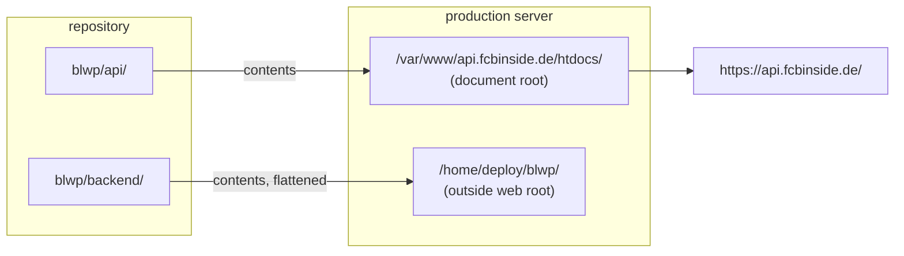

# Deployment

The repo is deployed as **two separate trees to two different server paths**. This is the
single most confusing aspect of the setup, and it is why a plain `git pull` on the server
cannot work.



| Development            | Production                                |
| ---------------------- | ----------------------------------------- |
| `blwp/api/data/`       | `/var/www/api.fcbinside.de/htdocs/data/`  |
| `blwp/api/v1/`         | `/var/www/api.fcbinside.de/htdocs/v1/`    |
| `blwp/api/cache/`      | `/var/www/api.fcbinside.de/htdocs/cache/` |
| `blwp/backend/config/` | `/home/deploy/blwp/config/`               |
| `blwp/backend/lib/`    | `/home/deploy/blwp/lib/`                  |
| `blwp/backend/inc/`    | `/home/deploy/blwp/inc/`                  |
| `blwp/backend/cron/`   | `/home/deploy/blwp/cron/`                 |
| `blwp/backend/logs/`   | `/home/deploy/blwp/logs/`                 |

`bootstrap.php` distinguishes the two by testing for `/home/deploy/blwp/config/api-config.php`.
**If that file is missing or unreadable, the service silently falls back to development paths**
and will try to write to `blwp/api/data` — which won't exist on the server. When production
misbehaves, verify that file first:

```bash
php -r 'require "/home/deploy/blwp/bootstrap.php";
        echo BLWP_ENV, "\n", BLWP_CONFIG_DIR, "\n", BLWP_DATA_PATH, "\n";'
```

**Deploy the backend before the plugin.** Backend changes are additive — a 1.0 plugin still
renders against the schema-2 payload because `status.short` and `status.long` are still
published — so backend-first can never leave a widget blank. The reverse order can.

## What survives a deploy, and what must not move

The gitignored files under `backend/config/` are **the server's own state**. They are absent
from the repo, so any deploy that mirrors the repo over the tree would delete them.

| Path                       | Rule                                                                     |
| -------------------------- | ------------------------------------------------------------------------ |
| `config/secrets.php`       | Never shipped. Create by hand on the server.                             |
| `config/site-mapping.json` | Never shipped. The live site registry and every site token.              |
| `config/cron-state.json`   | Never shipped. Safe to delete to start clean; rebuilt on the first tick. |
| `config/alerts.json`       | Never shipped. Alert throttle bookkeeping.                               |
| `logs/`                    | Never shipped.                                                           |
| `api/data/*.json`          | Generated. Delete to start fresh; the first tick rewrites them.          |
| `api/cache/img/`           | Generated. Purge whenever `img.php` changes, or old renders persist.     |

## Steps

### 0. Back up first

```bash
tar -czf /home/deploy/backup-$(date +%F-%H%M).tar.gz -C /home/deploy blwp
chmod 600 /home/deploy/backup-*.tar.gz
```

It includes `config/`, so restoring returns the credentials too. This is the rollback.

### 1. Upload the web tree

```bash
scp -r api/* deploy@srv01:/var/www/api.fcbinside.de/htdocs/
```

Both `.htaccess` files in that tree are **Apache-only**. Laragon reads them in development;
nginx ignores them completely. On the production server the CORS header, the 60-second cache
and the JSON MIME type therefore have to come from the nginx vhost — see
[Static JSON headers](#static-json-headers). Shipping the files is still correct, they simply
do nothing there.

`api/data/` and `api/cache/` are generated, not source. Copying them just ships dev's
`testwp.test.json` and dev's rendered logos to production; the cron rewrites the real ones
within 3 minutes either way.

### 2. Upload the private tree — excluding the runtime state

Do **not** `scp -r backend/*`. `scp` copies the _working tree_, not the git index, so that also
uploads `config/secrets.php` and `config/site-mapping.json` — your **development** credentials
and **development** site registry — straight over production's live ones.

```powershell
# from the dev machine
tar --exclude=config/secrets.php --exclude=config/site-mapping.json --exclude=config/cron-state.json --exclude=config/alerts.json --exclude=logs -czf backend.tar -C c:\laragon\www\blwp\backend .
scp backend.tar deploy@srv01:/tmp/
```

```bash
# on the server
tar -xzf /tmp/backend.tar -C /home/deploy/blwp
```

`tar -x` only adds and overwrites — it never deletes. Anything absent from the archive,
including all four excluded files, is left exactly as it was.

> **Verify the archive before uploading it.** The excludes are what protect the credentials,
> and a silently-ignored pattern would overwrite them. This must print exactly four lines:
>
> ```powershell
> tar -tzf $env:TEMP\backend.tar | Select-String "config/"
> ```
>
> ```
> ./config/
> ./config/api-config.php
> ./config/secrets.example.php
> ./config/site-mapping.example.json
> ```
>
> If `secrets.php`, `site-mapping.json`, `cron-state.json` or `alerts.json` appear — stop.

### 3. Directories and permissions

```bash
mkdir -p /var/www/api.fcbinside.de/htdocs/data
mkdir -p /var/www/api.fcbinside.de/htdocs/cache/img
mkdir -p /home/deploy/blwp/logs
chown -R deploy:www-data /var/www/api.fcbinside.de/htdocs/data /var/www/api.fcbinside.de/htdocs/cache
chmod -R 775 /var/www/api.fcbinside.de/htdocs/data /var/www/api.fcbinside.de/htdocs/cache
```

The private tree is owner-only, and nothing else needs access to it — the cron, the API and the
files are all the `deploy` account (see [permissions.md](permissions.md)):

```bash
chmod -R go-rwx /home/deploy/blwp
```

Check the result: directories `drwx------`, files `-rw-------`. If you find `drwx---rwx`
(0707) instead, that is a world-writable directory containing code the cron executes — fix it.

### 4. Confirm the production config

- `secrets.php` — **create it once, by hand.** It is gitignored and the upload above
  deliberately excludes it, so it never arrives with a deploy:

  ```bash
  cd /home/deploy/blwp
  cp config/secrets.example.php config/secrets.php
  chmod 600 config/secrets.php
  ```

  Fill in all five live values: `api_key`, `shared_secret`, `telegram_bot_token`,
  `telegram_chat_id`, `healthcheck_ping_url`. The last three are optional — without the
  Telegram pair alerting is a silent no-op, and without the ping URL the dead-man's switch is
  inert. Nothing errors, it just goes quiet, which is the opposite of what you want.

  ```bash
  php -r '$s = require "config/secrets.php"; foreach ($s as $k => $v) printf("%-24s %s\n", $k, ($v === "" ? "MISSING" : "set"));'
  ```

- `api-config.php` — `data_path` pointing at the real web-root data directory
- `site-mapping.json` — real domains, each with a token; `testwp.test` must **not** be the
  only entry
- `cors.php` — every customer domain present in `$allowed_origins`

  Before a first upload to a new server, check for two other things:

  ```bash
  php -r 'var_dump(is_writable("/home/deploy/blwp/config"));'   # alert throttling needs this
  ```

  and that the host can reach the internet — outbound to `api.telegram.org` and
  `hc-ping.com` is blocked on some hosts, which silently kills both alert channels.

### 5. Verify PHP and run once by hand

```bash
which php                                  # use this path in crontab
php -l /home/deploy/blwp/bootstrap.php     # and any file you changed
php /home/deploy/blwp/cron/fetch_all.php
wc -l /home/deploy/blwp/logs/api.log
```

**The run should print nothing, and `logs/` should still be empty.** That is the designed
behaviour, not a symptom — a healthy tick logs zero lines. If `api.log` appears, read it: it
contains something real.

### 6. Install the cron entry

See [Scheduling](operations.md#scheduling-cron). Last step, deliberately — get one clean manual
run first.

### 7. Point the plugin at production

In each WordPress site the API URL is auto-detected: `blwp_get_api_url()` returns
`https://api.fcbinside.de/` for any host that doesn't end in a dev TLD (`.test`, `.local`,
`.localhost`, `.dev`), or when `BLWP_API_URL` is defined. Then **save the plugin settings** so
the site registers itself.

### 8. Smoke test

```bash
curl -s https://api.fcbinside.de/data/<domain>.json | head -c 300
curl -sI "https://api.fcbinside.de/v1/img.php?url=https%3A%2F%2Fmedia.api-sports.io%2Ffootball%2Fteams%2F157.png&s=20" | head -1
```

### 9. Wait one tick, then run the health check

It exits non-zero if the scheduler is not running, if any site failed, or if a data file is
missing or stale — so a deploy script (or an external monitor) can use the exit code directly:

```bash
php /home/deploy/blwp/cron/check_health.php
```

Right after a deploy it reports `UNHEALTHY - No run recorded yet`. That is correct until the
first tick completes.

## Static JSON headers

The widget's `main.js` fetches `https://api.fcbinside.de/data/{domain}.json` **cross-origin**
from the customer's page. That file is served statically by nginx, so it never touches PHP, and
the `.htaccess` files that appear to configure it are ignored. Whatever nginx sends _is_ the
entire policy.

Three headers are required on `/data/*.json`:

| Header                        | Value                | Why                                                                                                                                 |
| ----------------------------- | -------------------- | ----------------------------------------------------------------------------------------------------------------------------------- |
| `Access-Control-Allow-Origin` | `*`                  | Without it the browser blocks the fetch outright and the widget renders nothing.                                                    |
| `Cache-Control`               | `public, max-age=60` | Otherwise browsers apply _heuristic_ caching and can serve a stale payload for minutes — during a match, which is the worst moment. |
| `Content-Type`                | `application/json`   | Usually already covered by nginx's `mime.types`.                                                                                    |

```nginx
location ~* \.json$ {
    add_header Access-Control-Allow-Origin "*" always;
    add_header Cache-Control "public, max-age=60" always;
}
```

`v1/` needs none of this. `fetch.php` and `register.php` are called server-to-server from
WordPress, so CORS never applies to them. `img.php` _is_ browser-fetched, but as an
``, which is not subject to CORS either.

Three nginx traps that break this quietly:

1. **`add_header` appends; Apache's `Header set` replaces.** A _global_
   `Access-Control-Allow-Origin` would give `img.php` two ACAO headers — nginx's plus the one
   `handle_cors()` sets — and browsers reject duplicate values. Scope it to `\.json$`.
2. **`add_header` is not inherited** by a `location` block that declares its own `add_header`.
   Put this in `server{}` while adding a security header inside `location ~ \.php$` and the
   CORS header silently disappears.
3. **Without `always` it only applies to 2xx/3xx/304**, so a 404 arrives without CORS and is
   far harder to debug.

Verify from outside the server:

```bash
curl -s -D - -o /dev/null -H "Origin: https://fcbinside.de" \
  https://api.fcbinside.de/data/standings.json \
  | grep -iE "^(HTTP/|content-type|access-control|cache-control)"
```

## Deploying with git instead

The tarball above is the recommended default: two commands, no repository on the server, and
nothing is ever deleted. A plain `git pull` will **not** work, and the reason is the asymmetry
shown above:

| Repo path    | Production destination                                  |
| ------------ | ------------------------------------------------------- |
| `api/**`     | `/var/www/api.fcbinside.de/htdocs/` (contents)          |
| `backend/**` | `/home/deploy/blwp/` (contents, **`backend/` dropped**) |

A clone at `/home/deploy/blwp` produces `/home/deploy/blwp/api/…` and
`/home/deploy/blwp/backend/…`. `bootstrap.php` then fails its test for
`/home/deploy/blwp/config/api-config.php`, **silently takes the development branch**, and the
site looks deployed while pointing at the wrong paths. One pull cannot populate two
destinations when one of them also loses a directory level.

What a pull _does_ get right is that git never touches untracked or ignored files, so
`secrets.php`, `site-mapping.json`, `cron-state.json`, `alerts.json`, `logs/` and
`api/data/*.json` all survive automatically.

`git archive` extracts one subtree, and `--strip-components=1` drops the `backend/` level —
exactly the shape production wants. Like the tarball, it only adds and overwrites:

```bash
# one-time, somewhere that is NOT a deploy target
git clone <remote> /home/deploy/blwp-src

# each deploy
cd /home/deploy/blwp-src && git fetch origin && git pull

git archive origin/main backend | tar -x --strip-components=1 -C /home/deploy/blwp
git archive origin/main api     | tar -x --strip-components=1 -C /var/www/api.fcbinside.de/htdocs
```

Or archive locally and upload, which keeps no repository on the server at all:

```powershell
git -C c:\laragon\www\blwp archive origin/main backend -o backend.tar
```

**Never let a `.git/` directory land inside `/var/www/api.fcbinside.de/htdocs/`.** Apache will
serve `/.git/config` and anything else it finds in there. The `.htaccess` files protect `data/`
and `cache/`, not a stray repo — which is the other reason not to clone into the document root.

**Never use `rsync --delete` for either tree.** It would treat the repo contents as
authoritative, find that `secrets.php`, `site-mapping.json`, `cron-state.json`, `alerts.json`
and `logs/` are not in the source, and delete them. That is a credential wipe and a
site-registry wipe in one command.

Note the commit before deploying (`git log --oneline -1`) so you have a rollback point.
Reverting only affects tracked files — runtime state is never part of it.

## Rollback

```bash
# whole tree, from step 0's backup
tar -xzf /home/deploy/backup-<timestamp>.tar.gz -C /home/deploy

# or just the public tree
tar -xzf /home/deploy/htdocs-<timestamp>.tar.gz -C /var/www/api.fcbinside.de
```

A rollback restores `config/` too, including `secrets.php` and `site-mapping.json` — which is
why the backup is taken before anything is uploaded, not after.
