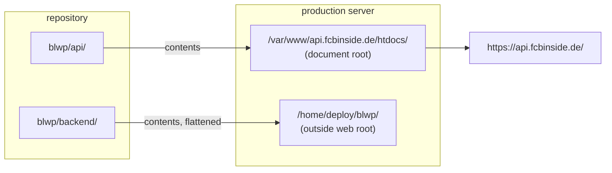

# Operations

Running, deploying and troubleshooting the BLWP backend.

- [Scheduling (cron)](#scheduling-cron)
- [Deployment](#deployment)
- [Security](#security)
- [Logs](#logs)
- [Cache management](#cache-management)
- [API quota](#api-quota)
- [Season rollover](#season-rollover)
- [Troubleshooting](#troubleshooting)
- [Housekeeping](#housekeeping)

---

## Scheduling (cron)

`backend/cron/fetch_all.php` is the only scheduled entry point. It has no scheduling logic
of its own — every run refreshes the standings and every enabled site. The tick frequency
_is_ the schedule; see [D2](architecture.md#d2--the-cron-always-updates-everything).

**What one run does:**

1. Load `config/site-mapping.json` and `config/cron-state.json`
2. `update_global_standings($config, $cron_state)`
   - recompute the table from all league fixtures
   - call `getStandings()` for the metadata merge (every run)
   - cross-check the local table against it only every 60 min
3. For each entry with `enabled: true` → `fetch_site_data($domain, $config)`
4. Write `cron-state.json`

**Development (Windows Task Scheduler):**

```
php C:\laragon\www\blwp\backend\cron\fetch_all.php
```

**Production (Linux crontab):**

```cron
*/3 * * * * /usr/bin/php /home/deploy/blwp/cron/fetch_all.php >> /home/deploy/blwp/logs/cron.log 2>&1
```

> Note the path: in production the `backend/` contents are flattened into `/home/deploy/blwp/`.
> Older notes in the plugin's `dev_ops.txt` refer to `~/buli-widgets-api/cron/fetch_all.php`
> and a `* * * * *` (every minute) schedule. Both are stale — the folder was renamed and the
> job runs every **3 minutes**. That is a deliberate quota decision, not an oversight.

**Manual runs** are safe at any time. They consume a little quota and rewrite the same
files the cron writes.

---

## Deployment

The repo is deployed as **two separate trees to two different servers paths**. This is the
single most confusing aspect of the setup.



| Development            | Production                                |
| ---------------------- | ----------------------------------------- |
| `blwp/api/data/`       | `/var/www/api.fcbinside.de/htdocs/data/`  |
| `blwp/api/v1/`         | `/var/www/api.fcbinside.de/htdocs/v1/`    |
| `blwp/api/cache/`      | `/var/www/api.fcbinside.de/htdocs/cache/` |
| `blwp/backend/config/` | `/home/deploy/blwp/config/`               |
| `blwp/backend/lib/`    | `/home/deploy/blwp/lib/`                  |
| `blwp/backend/inc/`    | `/home/deploy/blwp/inc/`                  |
| `blwp/backend/cron/`   | `/home/deploy/blwp/cron/`                 |
| `blwp/backend/logs/`   | `/home/deploy/blwp/logs/`                 |

`bootstrap.php` distinguishes the two by testing for `/home/deploy/blwp/config/api-config.php`.
**If that file is missing or unreadable, the service silently falls back to development paths**
and will try to write to `blwp/api/data` — which won't exist on the server. When production
misbehaves, verify that file first.

### Steps

1. **Upload the web tree**

   ```bash
   scp -r api/* deploy@srv01:/var/www/api.fcbinside.de/htdocs/
   ```

   Both `.htaccess` files in that tree are **Apache-only**. Laragon reads them in
   development; nginx ignores them completely. On the production server the CORS header, the
   60-second cache and the JSON MIME type therefore have to come from the nginx vhost — see
   [Static JSON headers](#static-json-headers). Shipping the files is still correct, they
   simply do nothing there.

   `api/data/` and `api/cache/` are generated, not source. Copying them just ships dev's
   `testwp.test.json` and dev's rendered logos to production; the cron rewrites the real ones
   within 3 minutes either way.

2. **Upload the private tree — excluding the runtime state**

   Do **not** `scp -r backend/*`. `scp` copies the _working tree_, not the git index, so that
   also uploads `config/secrets.php` and `config/site-mapping.json` — your **development**
   credentials and **development** site registry — straight over production's live ones.
   Build a tarball that leaves them out instead:

   ```powershell
   # from the dev machine
   tar --exclude=config/secrets.php --exclude=config/site-mapping.json --exclude=config/cron-state.json --exclude=config/alerts.json --exclude=logs -czf backend.tar -C c:\laragon\www\blwp\backend .
   scp backend.tar deploy@srv01:/tmp/
   ```

   ```bash
   # on the server
   tar -xzf /tmp/backend.tar -C /home/deploy/blwp
   ```

   Four paths are excluded on purpose. They are gitignored runtime state that belongs to the
   server, and dev's copies must never replace them:

   | Excluded                   | Why                                                                                                     |
   | -------------------------- | ------------------------------------------------------------------------------------------------------- |
   | `config/secrets.php`       | Live credentials. Pointing dev's key at production's site registry is an instant wall of 403s.          |
   | `config/site-mapping.json` | The live site registry. Dev's copy contains only `testwp.test`, so every real site would stop updating. |
   | `config/cron-state.json`   | Dev's `last_run` would make `check_health.php` report a healthy pipeline that isn't running.            |
   | `config/alerts.json`       | Throttle bookkeeping. Harmless either way, but it is the server's own state.                            |

   `tar -x` only adds and overwrites — it never deletes. Anything absent from the archive,
   including all four files above, is left exactly as it was.

3. **Directories and permissions**

   ```bash
   mkdir -p /var/www/api.fcbinside.de/htdocs/data
   mkdir -p /var/www/api.fcbinside.de/htdocs/cache/img
   mkdir -p /home/deploy/blwp/logs
   chown -R deploy:www-data /var/www/api.fcbinside.de/htdocs/data /var/www/api.fcbinside.de/htdocs/cache
   chmod -R 775 /var/www/api.fcbinside.de/htdocs/data /var/www/api.fcbinside.de/htdocs/cache
   chmod 700 /home/deploy/blwp/config
   ```

4. **Confirm the production config**
   - `secrets.php` — **create it once, by hand.** It is gitignored and the upload above
     explicitly excludes it, so it never arrives with a deploy:
     `cp config/secrets.example.php config/secrets.php`, then `chmod 600` and fill in all five
     live values — `api_key`, `shared_secret`, `telegram_bot_token`, `telegram_chat_id`,
     `healthcheck_ping_url`. The last three are optional: without the Telegram pair alerting
     is a silent no-op, and without the ping URL the dead-man's switch is inert. Nothing
     errors — it just goes quiet, which is the opposite of what you want.
   - `api-config.php` — `data_path` pointing at the real web-root data directory
   - `site-mapping.json` — real domains, each with a token; `testwp.test` must **not** be
     the only entry
   - `cors.php` — every customer domain present in `$allowed_origins`

5. **Verify PHP and run once by hand**

   ```bash
   which php                                  # use this path in crontab
   php /home/deploy/blwp/cron/fetch_all.php
   tail -20 /home/deploy/blwp/logs/api.log
   ```

6. **Install the cron entry** (see [Scheduling](#scheduling-cron)).

7. **Point the plugin at production.** In each WordPress site, the API URL is auto-detected:
   `blwp_get_api_url()` returns `https://api.fcbinside.de/` for any host that doesn't end in
   a dev TLD (`.test`, `.local`, `.localhost`, `.dev`), or when `BLWP_API_URL` is defined.
   Then **save the plugin settings** so the site registers itself.

8. **Smoke test**

   ```bash
   curl https://api.fcbinside.de/data/<domain>.json | head -c 300
   curl -I "https://api.fcbinside.de/v1/img.php?url=https%3A%2F%2Fmedia.api-sports.io%2Ffootball%2Fteams%2F157.png&s=20"
   ```

9. **Wait one tick, then run the health check.** It exits non-zero if the scheduler is not
   running, if any site failed, or if a data file is missing or stale — so a deploy script
   (or an external monitor) can use the exit code directly:

   ```bash
   php /home/deploy/blwp/cron/check_health.php
   ```

### Static JSON headers

The widget's `main.js` fetches `https://api.fcbinside.de/data/{domain}.json`
**cross-origin** from the customer's page. That file is served statically by nginx, so it
never touches PHP, and the `.htaccess` files that appear to configure it are ignored.
Whatever nginx sends _is_ the entire policy.

Three headers are required on `/data/*.json`:

| Header                        | Value                | Why                                                                                                                                 |
| ----------------------------- | -------------------- | ----------------------------------------------------------------------------------------------------------------------------------- |
| `Access-Control-Allow-Origin` | `*`                  | Without it the browser blocks the fetch outright and the widget renders nothing.                                                    |
| `Cache-Control`               | `public, max-age=60` | Otherwise browsers apply _heuristic_ caching and can serve a stale payload for minutes — during a match, which is the worst moment. |
| `Content-Type`                | `application/json`   | Usually already covered by nginx's `mime.types`.                                                                                    |

```nginx
location ~* \.json$ {
    add_header Access-Control-Allow-Origin "*" always;
    add_header Cache-Control "public, max-age=60" always;
}
```

`v1/` needs none of this. `fetch.php` and `register.php` are called server-to-server from
WordPress, so CORS never applies to them. `img.php` _is_ browser-fetched, but as an
``, which is not subject to CORS either.

Three nginx traps that break this quietly:

1. **`add_header` appends; Apache's `Header set` replaces.** A _global_
   `Access-Control-Allow-Origin` would give `img.php` two ACAO headers — nginx's plus the one
   `handle_cors()` sets — and browsers reject duplicate values. Scope it to `\.json$`.
2. **`add_header` is not inherited** by a `location` block that declares its own
   `add_header`. Put this in `server{}` while adding a security header inside
   `location ~ \.php$` and the CORS header silently disappears.
3. **Without `always` it only applies to 2xx/3xx/304**, so a 404 arrives without CORS and is
   far harder to debug.

Verify from outside the server:

```bash
curl -s -D - -o /dev/null -H "Origin: https://fcbinside.de" \
  https://api.fcbinside.de/data/standings.json \
  | grep -iE "^(HTTP/|content-type|access-control|cache-control)"
```

### Deploying with git instead

The tarball above is the recommended default: two commands, no repository on the server, and
nothing is ever deleted. A plain `git pull` will **not** work, and the reason is the
asymmetry shown above:

| Repo path    | Production destination                                  |
| ------------ | ------------------------------------------------------- |
| `api/**`     | `/var/www/api.fcbinside.de/htdocs/` (contents)          |
| `backend/**` | `/home/deploy/blwp/` (contents, **`backend/` dropped**) |

A clone at `/home/deploy/blwp` produces `/home/deploy/blwp/api/…` and
`/home/deploy/blwp/backend/…`. `bootstrap.php` then fails its test for
`/home/deploy/blwp/config/api-config.php`, **silently takes the development branch**, and the
site looks deployed while pointing at the wrong paths. One pull cannot populate two
destinations when one of them also loses a directory level.

What a pull _does_ get right is that git never touches untracked or ignored files, so
`secrets.php`, `site-mapping.json`, `cron-state.json`, `alerts.json`, `logs/` and
`api/data/*.json` all survive automatically.

`git archive` extracts one subtree, and `--strip-components=1` drops the `backend/` level —
exactly the shape production wants. Like the tarball, it only adds and overwrites:

```bash
# one-time, somewhere that is NOT a deploy target
git clone <remote> /home/deploy/blwp-src

# each deploy
cd /home/deploy/blwp-src && git fetch origin && git pull

git archive origin/main backend | tar -x --strip-components=1 -C /home/deploy/blwp
git archive origin/main api     | tar -x --strip-components=1 -C /var/www/api.fcbinside.de/htdocs
```

Or archive locally and upload, which keeps no repository on the server at all:

```powershell
git -C c:\laragon\www\blwp archive origin/main backend -o backend.tar
```

**Never let a `.git/` directory land inside `/var/www/api.fcbinside.de/htdocs/`.** Apache will
serve `/.git/config` and anything else it finds in there. The `.htaccess` files protect
`data/` and `cache/`, not a stray repo — which is the other reason not to clone into the
document root.

**Never use `rsync --delete` for either tree.** It would treat the repo contents as
authoritative, find that `secrets.php`, `site-mapping.json`, `cron-state.json`,
`alerts.json` and `logs/` are not in the source, and delete them. That is a credential wipe
and a site-registry wipe in one command.

Note the commit before deploying (`git log --oneline -1`) so you have a rollback point.
Reverting only affects tracked files — runtime state is never part of it.

---

## Security

### Threat model

The only credential that grants write access to this service is
**`shared_secret` in `config/secrets.php`**. Whoever holds it can call `register.php` for any
domain, with any token, overwriting existing mapping entries. There is no IP allowlist and
no per-site signature on that endpoint.

`api_token` values are per-site and only grant the ability to force a refresh (rate limited,
read-only against upstream). Leaking one is far less severe than leaking the shared secret.

### Protections in place

| Path                       | Protection                                                                                                                                                          |
| -------------------------- | ------------------------------------------------------------------------------------------------------------------------------------------------------------------- |
| `backend/`                 | **Denied** by `backend/.htaccess` under Apache (dev). nginx ignores that file — there, protection comes from the path rather than the file                          |
| Production `backend/`      | Sits at `/home/deploy/blwp/`, outside the document root entirely                                                                                                    |
| `config/secrets.php`       | **Gitignored.** Holds `api_key` + `shared_secret`; the `secrets.example.php` template is committed                                                                  |
| `config/site-mapping.json` | **Gitignored.** Holds every site's token; the `site-mapping.example.json` template is committed                                                                     |
| `api/data/`                | Public by design. `Access-Control-Allow-Origin: *` and `Cache-Control: max-age=60` come from the **nginx vhost** in production and from `api/data/.htaccess` in dev |
| `api/`                     | `api/.htaccess` sets the dev origin. Apache-only, so it has no effect in production                                                                                 |

### Outstanding

1. **Secrets remain in git _history_.** They are no longer tracked (see
   [Protections in place](#protections-in-place)), but the `api_key`, `shared_secret` and a
   site token still exist in blobs from earlier commits — `git rm --cached` does not purge
   history. Because this repo has no remote and no other clone, rewriting history is safe
   and sufficient; otherwise the credentials must be rotated. **Do not push before
   resolving this.**
2. **The image cache is publicly readable in production.** `api/cache/img/` lands inside the
   document root, so `https://api.fcbinside.de/cache/img/<md5>.webp` resolves. `img.php`
   only reads it from disk, so nothing depends on that exposure. Denying it is a one-line
   nginx change — `location ^~ /cache/ { deny all; }` — at the cost of the files no longer
   being served by the web server for free. (An `.htaccess` only helps under Apache, so that
   route would not work here.)
3. **CORS allowlist is hardcoded** and needs a deploy per new client. A data-driven list
   (derived from `site-mapping.json`) would remove that step.
4. **`register.php` echoes the token back** in its response. Convenient for debugging, but
   make sure it is never logged by an intermediary.

---

## Logs

All logging funnels into **one file per environment**:

| Environment | File                             |
| ----------- | -------------------------------- |
| Development | `backend/logs/api.log`           |
| Production  | `/home/deploy/blwp/logs/api.log` |

Prefixes identify the writer: none for the cron, `[FETCH]` for `fetch.php`,
`[REGISTER]` for `register.php`.

A second file, `fetch-debug.log`, is written by `fetch.php` _before_ bootstrap runs so that
crashes during bootstrap are still captured. In production its path resolves incorrectly —
see [Known issues](architecture.md#known-issues--debt).

### Log discipline

**A healthy run writes nothing.** The cron ticks 480 times a day, so anything logged on every
tick is 480 identical lines a day — and a log you cannot scan is worse than no log at all.
What is worth knowing after a normal run lives in `cron-state.json` (`last_run`,
`last_run_ok`, `last_run_summary`), where a monitor can read it as data instead of parsing
prose.

An empty log is therefore the expected state, not a symptom:

```powershell
# Is the log growing while nothing is actually wrong?
Get-Item c:\laragon\www\blwp\backend\logs\api.log | Select-Object Length, LastWriteTime
```

The per-tick detail still exists, behind a switch:

```php
// backend/config/api-config.php
'log_verbose' => true,   // per-tick counts, saved files, passing validations
```

That restores `Categorization complete`, `Saved global standings.json`,
`✓ Standings validation passed` and `site-mapping.json not found`. Turn it on while
diagnosing something, then turn it back off.

`api.log` rotates to `api.log.1` at 1 MB, one generation only — a retry loop stuck on the
same error would otherwise grow the file without any bound.

### Lines that matter

| Pattern                                                 | Meaning                                                                                          |
| ------------------------------------------------------- | ------------------------------------------------------------------------------------------------ |
| `✗ Standings validation failed`                         | The local calculation disagrees with the API. Followed by a field-by-field diff per team.        |
| `API error in getFixtures/getResults/getFixturesByDate` | Upstream failure. The site's data file was **not** written, so the last good data is still live. |
| `ERROR updating <domain>`                               | Per-site failure, see the message                                                                |
| `ERROR - could not write`                               | The payload was not published — `file_put_contents()` failed or came up short                    |
| `WARNING - getStandings() returned no rows`             | Metadata comes from the cache; the calculated table is unaffected                                |
| `ALERT NOT SENT`                                        | Telegram rejected the alert — the one failure that would otherwise stay invisible                |
| `WARNING - healthcheck ping failed`                     | The external monitor will now report the cron as down                                            |
| `Live Bundesliga: N game(s)`                            | Only on transition (0→N, N→0, or a status change), never once per tick                           |
| `UNAUTHORIZED - Secret key mismatch`                    | A plugin has the wrong `shared_secret`                                                           |
| `Invalid token for domain`                              | Plugin and `site-mapping.json` disagree — re-save the plugin settings                            |
| `RATE LIMIT`                                            | Manual refresh attempted too soon (expected, not an error)                                       |

> Many log calls in `fetch-functions.php` are commented out. Uncomment them for a
> debugging session, but be aware the file is rewritten on every deploy.

---

## Alerting

Two independent channels. They exist as a pair because they fail in disjoint ways.

|          | Telegram (inside-out)                                                      | healthchecks.io (outside-in)                        |
| -------- | -------------------------------------------------------------------------- | --------------------------------------------------- |
| Reports  | `blwp_notify()` in `lib/notify.php`                                        | an external monitor                                 |
| Knows    | _what_ broke, with detail                                                  | only _that_ something stopped                       |
| Catches  | site update failed, payload not written, standings empty, validation drift | scheduler disabled, PHP fatal, dead host, disk full |
| Blind to | its own death — it cannot report anything if it never runs                 | everything granular                                 |

A process cannot report that it stopped running. That is the entire reason for the second
channel, and why neither one is redundant.

### Telegram

```php
// backend/config/secrets.php
'telegram_bot_token' => '123456789:AAE…',
'telegram_chat_id'   => '123456789',
```

1. In Telegram, message **@BotFather** → `/newbot`, and copy the token.
2. **Send your new bot `/start`.** A bot cannot open a conversation itself and
   `sendMessage` answers `403: bot can't initiate conversation` until you have. This is the
   step everyone misses.
3. Read `message.chat.id` from `https://api.telegram.org/bot<token>/getUpdates`.

Leave either value empty and every `blwp_notify()` call becomes a **silent no-op** — which
is what development and a fresh clone want. Nothing else has to be configured.

**Throttling is not optional.** An expired API key fails on all 480 ticks a day, and an
unthrottled notifier turns one outage into 480 messages — a second outage. Each alert _key_
(`site:example.test`, `standings`, `validation`) may therefore fire at most once per
`intervals.alert_throttle` (default **240** minutes). Further occurrences inside that window
are counted, and the count is attached to the next message that does go out:

```
Update failed for testwp.test
…
(+37 more since the last alert for this problem)
```

When a problem clears, `blwp_notify_recovered()` sends an all-clear — but only while an alert
for that key is still outstanding. Without it, silence is ambiguous: throttled and fixed look
identical. The bookkeeping lives in `backend/config/alerts.json` (gitignored), deliberately
not in `cron-state.json` — the cron loads that file once and writes it back at the end, which
would discard anything written to it mid-run.

### healthchecks.io

The free tier ("Hobbyist") is **20 jobs**, with unlimited pings: one job absorbs all 480
daily pings. The billed limit is retained ping _history_ (100 entries per job), not a cap on
runs.

1. Create a free account and a check with a period of **5 minutes** and a grace time of
   **5 minutes**.
2. Copy the ping URL (`https://hc-ping.com/<uuid>`) into `secrets.php` as
   `healthcheck_ping_url`.
3. In that check's **Integrations**, connect **Telegram**. This half needs no code at all for
   its notifications.

`cron/fetch_all.php` pings it once at the very end of a tick, and that is the only signal it
sends. Deliberately a plain ping and never `/fail`: this channel means "the pipeline is
alive", so reporting a site-level failure here too would duplicate the Telegram alert. The
value is in what does **not** happen — a fatal, a disabled scheduler or an unreachable host
produces no request at all, and the monitor alerts on that silence.

`cron/check_health.php` is the manual companion: it exits non-zero when the run is stale or a
data file is missing, which makes it usable from a deploy script. But something has to
_invoke_ it, so it cannot stand in for the external heartbeat.

---

## Cache management

The image cache lives at `api/cache/img/`, one WebP per `md5(url + "_" + size)`.

```powershell
# Inspect
Get-ChildItem c:\laragon\www\blwp\api\cache\img | Measure-Object

# Purge (regenerated on demand; costs nothing but the first-hit latency)
Remove-Item -Force c:\laragon\www\blwp\api\cache\img\*
```

**When to purge:**

- After changing anything in `img.php` (quality, resize algorithm, render size) — existing
  files keep the old appearance forever otherwise.
- If logos look stale after an upstream CDN change.

The directory is gitignored. A legacy cache at `backend/cache/` was removed; if you see it
reappear, something is still using `BLWP_PRIVATE_PATH . '/cache'`.

> There is no eviction. ~40 logos × 3 sizes ≈ 120 files of a few KB each, so this is a
> non-issue at current scale, but a very large number of client sites would eventually want
> a TTL sweep.

---

## API quota

api-sports.io plan: **75,000 requests/day**.

| Consumer                                                             | Frequency               | Approx. calls/day |
| -------------------------------------------------------------------- | ----------------------- | ----------------- |
| Cron — per site (`getFixtures` + `getResults` + `getFixturesByDate`) | every 3 min             | 3 × 480 × _sites_ |
| Cron — standings (`getLeagueFixtures`)                               | every 3 min             | 480               |
| Cron — `getStandings`                                                | every 3 min             | 480               |
| Manual refresh                                                       | on demand, rate limited | negligible        |

With two sites that is roughly **3,860/day — about 5% of quota**. Adding sites scales
linearly on the per-site term, so the headroom is large but not unlimited: ~20 sites would
reach ~50%.

**Levers if quota ever becomes tight, in order of preference:**

1. Raise the tick interval (linear reduction, trivial change).
2. Cache `getLeagueFixtures` — the largest fixed cost, and it changes slowly.
3. Reintroduce live-game-aware scheduling. This was deliberately removed
   ([D2](architecture.md#d2--the-cron-always-updates-everything)) because the failure mode
   was stale data during matches. Only do it with a much better detection mechanism.

---

## Season rollover

The season runs **July 1 → June 30** (`getCurrentSeason()` in `utils.php`).

At rollover:

1. **Check `site-mapping.json`** — each entry's `season` field is stale. It only feeds
   `meta.season` today, but fix it before season scoping is added anywhere.
2. **Nothing to do for the season.** The plugin no longer sends one; the backend derives it
   from the calendar on every run, so `meta.season` is always current. The `blwp_season`
   option is only forwarded if you set it explicitly — which is now the only way to pin a
   single site to a specific season:

   ```bash
   wp option update blwp_season 2026 --path=/path/to/wordpress
   ```

3. **Let `default_season` recalculate** — it is derived, not stored. `update_global_standings()`
   picks up the new season automatically.
4. **Expect a busy first run** — `getLeagueFixtures` for a fresh season returns few fixtures,
   so early-season standings will be sparse. That is correct, not a bug.
5. **Purge nothing.** The image cache is keyed by URL, and logos don't change per season.

---

## Troubleshooting

### A widget shows stale data

1. Check the data file's `meta.generated_at`:
   `https://blwp.test/api/data/testwp.test.json`
2. If it is old, check the log for an abort: look for `aborting to preserve stale data`.
   That message means an upstream call failed and the write was skipped **on purpose**
   ([D9](architecture.md#d9--log-failures-preserve-stale-data)).
3. Run the cron by hand and watch the output.
4. If the file updates but the browser doesn't, remember `Cache-Control: max-age=60` on the
   JSON and 30 days on the images.

### No data file at all for a domain

- Is the domain in `site-mapping.json` with `enabled: true`?
- Did `register.php` ever succeed? Look for `SUCCESS - Domain registered` in the log.
- Does `data/` exist and is it writable by the PHP user?

### `Invalid token` (403)

The plugin's stored `blwp_api_token` and the mapping entry disagree. Re-saving the plugin
settings regenerates/forwards the token. To force a new one, delete the `blwp_api_token`
option — the plugin will mint a fresh one on the next save.

### Standings look wrong

1. Search the log for `✗ Standings validation failed` — it prints a per-team field diff.
2. If the diff is systematically in `points`/`goalsDiff`/`played`, suspect the fixture set
   from `getLeagueFixtures`, or a status-code classification change
   ([status table](reference.md#fixture-status-codes)).
3. If only `description` is wrong, that is the rank-keyed merge
   ([D4](architecture.md#d4--playoff-zone-labels-follow-rank-not-team)).
4. If a whole row is mislabelled, check `getTeamNameCorrections()` for a wrong ID — this has
   happened before with `180` vs `167`.

### Icons look blurry or stale

- Purge `api/cache/img/` (see [Cache management](#cache-management)).
- Confirm the plugin is actually sending `&s=` and hitting `img.php` — inspect the DOM's
  `src` attributes. If they point at `media.api-sports.io`, `imgProxyUrl` is missing from
  `blwp_get_widget_config()`.
- `X-Cache: MISS` on every request means the cache directory isn't writable.

### Everything is broken after a deploy

1. Does `/home/deploy/blwp/config/api-config.php` exist and is it readable by the web
   user? This file is the production-detection probe — without it, dev paths are used.
2. Are the web-root files in place? Test a static asset:
   `https://api.fcbinside.de/data/standings.json`.
3. Is `cors.php` missing the customer's domain? Symptoms appear only in the browser console.
4. Does `config/secrets.php` exist? It is gitignored, so a deploy never brings it. Its
   absence throws `MissingApiKey` naming the missing file — that error is the signal, not a
   symptom of something deeper.

---

## Housekeeping

Recommended, not yet done. These are repo-hygiene changes with history implications, so
they are left as explicit steps rather than applied automatically.

1. ~~**Stop tracking generated files**~~ **Done** — `cron-state.json`, `api/data/*.json` and
   `logs/*.log` are untracked and gitignored. (`api/data/.htaccess` stays tracked on purpose.)

2. ~~**Add `.gitattributes`**~~ **Done** — `* text=auto eol=lf` is in place in both repos,
   which overrides the machine's `core.autocrlf = true` and ends the whole-file diffs.

3. ~~**Untrack the secrets**~~ **Done** — `secrets.php` and `site-mapping.json` are
   gitignored with committed `*.example.*` templates. What remains is purging the
   credentials from _history_, which untracking does not do; see [Security](#security).

4. **Delete the dead code** once you are confident nothing external depends on it:
   `inc/ClubConfig.php`, `Exceptions/MissingApiKey.php`, and the legacy
   `BLWP_CONFIG_PATH` / `BLWP_LIB_PATH` / `BLWP_INC_PATH` / `BLWP_LOG_PATH` aliases.
